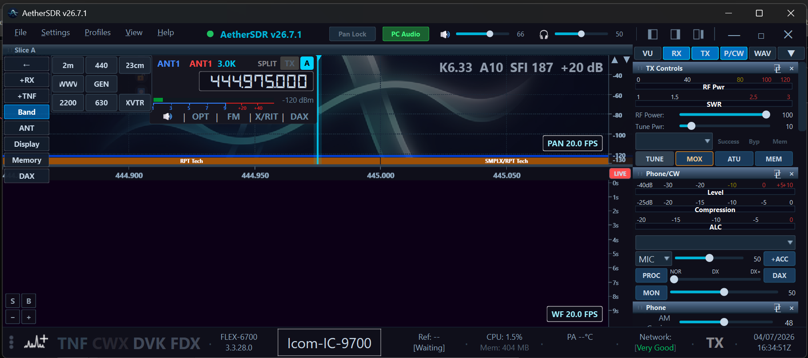
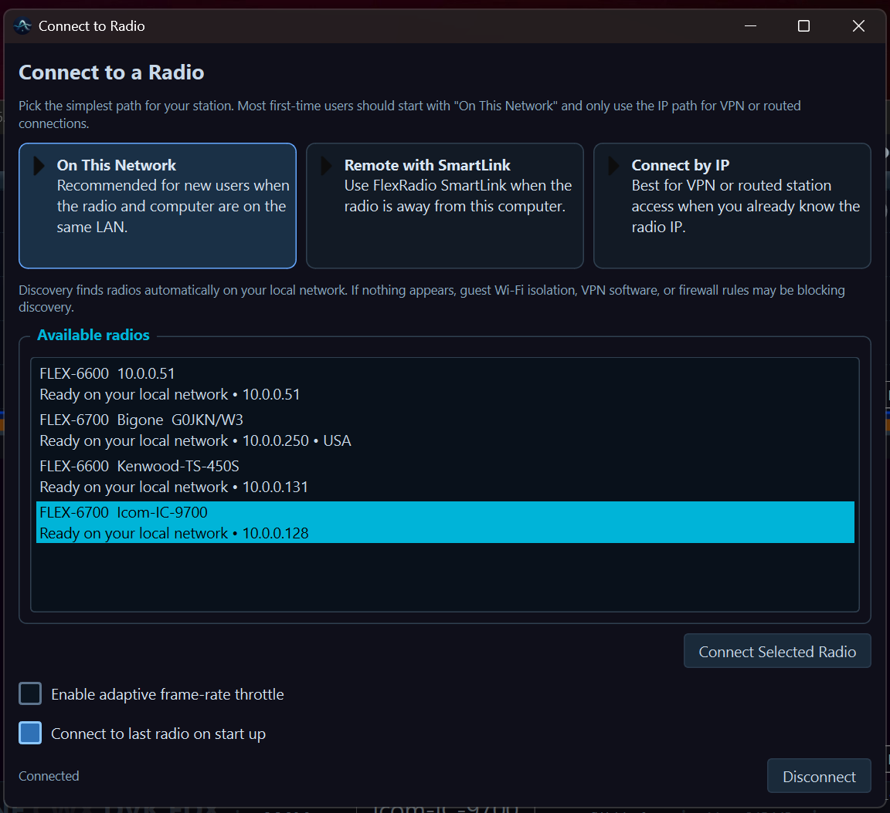
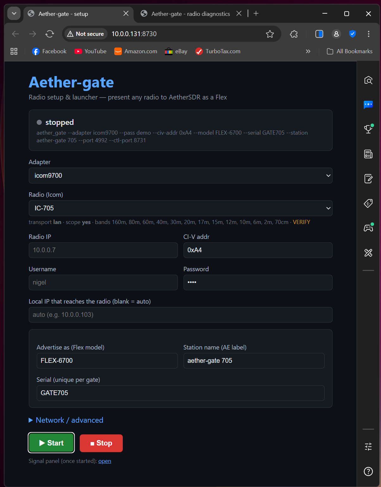
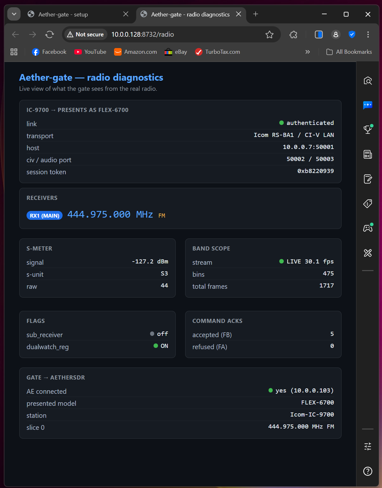

# Aether-gate

**Put any radio into [AetherSDR](https://github.com/aethersdr/AetherSDR).**

Aether-gate is a universal bridge that presents *any* radio — an Icom or Kenwood
transceiver, an RTL-SDR/Airspy dongle, anything you can read — to AetherSDR as if
it were a FlexRadio. AE speaks exactly one protocol (FlexRadio's); the gate does
the translation, so AE keeps a single, clean ingest boundary and the zoo of radio
sources lives outside it.

You pick your radio on a web page, hit **Start**, and it appears in AetherSDR's
radio chooser with a live panadapter and waterfall.

<p align="center">
  
  <br><em>An Icom IC-9700 bridged into AetherSDR — offered exactly the bands it can tune.</em>
</p>

> **Status:** working. Proven end-to-end on real hardware — an Icom IC-9700 (LAN,
> 2m/70cm/23cm) and a Kenwood TS-450S (CAT + SDR dongle for spectrum) both run live
> in AetherSDR with waterfall and control. A Raspberry Pi runs both at once as a
> boot-time appliance. Licensed **GPL-3.0-or-later**.

---

## What it does

- **Presents a radio to AetherSDR as a Flex 6000.** AE discovers it on the LAN and
  connects exactly as it would to a real FlexRadio — panadapter, waterfall, slices,
  frequency/mode control.
- **Two ways to get spectrum**, chosen per radio:
  - radios with their own spectrum scope (e.g. Icom LAN rigs) stream it directly;
  - radios without one (most CAT transceivers) get their waterfall from a cheap
    **SDR dongle** tapped off-air, steered to follow the rig's dial.
- **Declares its real bands.** A gateway rig that must impersonate a FLEX-6700 would
  otherwise be offered a full HF band menu it can't tune. Aether-gate tells AE the
  radio's true band set (via the `bands=` discovery key), so an IC-9700 shows only
  2m/440/23cm. *(Needs an AetherSDR build with radio-declared-band support.)*
- **Runs headless as a service** — on a Raspberry Pi it's a flash-and-go appliance;
  each radio is its own systemd service, always ready in AE's chooser.

## Supported radios

| Family | How | Spectrum | Status |
|---|---|---|---|
| **Icom LAN** (IC-9700, RS-BA1-style) | native LAN / CI-V | radio's own scope | ✅ proven (IC-9700) |
| **Kenwood / Yaesu / Elecraft / Icom-USB** (CAT) | hamlib (`rigctld`) | SDR dongle, CAT-steered | ✅ proven (Kenwood TS-450S); other hamlib rigs = same path |
| **SoapySDR dongles** (RTL-SDR, Airspy, SDRplay) | SoapySDR | the dongle itself | ✅ |
| **sim** | built-in test patterns | synthetic | ✅ (no hardware — for trying it out) |

See [RADIO_SUPPORT.md](RADIO_SUPPORT.md) for the two-axis (control + spectrum) model
and how to add a radio.

<p align="center">
  
  <br><em>Bridged radios appear in AetherSDR's chooser by name, alongside real FlexRadios.</em>
</p>

---

## Quick start

### Try it with no hardware

```bash
python -m aether_gate --adapter sim --ae <your-AE-ip>
```

A synthetic radio appears in AetherSDR's chooser. (Same host as AE? add
`--port 5992` so it doesn't clash with AE's own :4992.)

### The Setup page — pick a real radio in your browser

Just run it with no arguments:

```bash
python -m aether_gate            # opens the Setup UI + your browser
python -m aether_gate --setup    # same, explicit
python -m aether_gate --setup --no-browser   # headless: just prints the URL
```

This opens the **Radio Setup & launcher** at **http://localhost:8730/** — pick your
radio family (Icom / Kenwood / dongle / sim), fill in its connection fields, and hit
**Start**. Save it as a profile with *"connect on launch"* and it comes up on its own
next time.

<p align="center">
  
  <br><em>The Setup page (:8730) — choose a radio, fill its fields, Start.</em>
</p>

The Setup page links to a **Known Info / status** page (`/known`) — a turn-it-on
health check: is your advertise IP reachable, are the dependencies present, which
dongles/serial ports are found, and can each saved profile's radio actually be
reached.

### The Diagnostics page — what the gate sees from the radio

Every running gate serves a live **diagnostics page** on its control port
(`--ctl-port`, default **8731**): open

```
http://<gate-ip>:<ctl-port>/radio
```

for a 1-Hz view of the radio as the gate sees it — link/auth state, VFO
frequency + mode, scope frame rate, S-meter, tune counters. There's also raw JSON
at `/diagnostics` if you want to script against it.

<p align="center">
  
  <br><em>The diagnostics page (/radio on the gate's ctl-port) — the radio as the gate sees it.</em>
</p>

### Command line (the power path)

The Setup page just builds a command line for you; you can also run it directly:

```bash
# Icom IC-9700 over its LAN interface
python -m aether_gate --adapter icom9700 \
    --radio-ip 10.0.0.7 --user <net-user> --pass <net-pass> \
    --ae <AE-ip> --ctl-port 8732

# Kenwood TS-450S: hamlib CAT + an RTL-SDR-Blog V4 dongle for the waterfall
python -m aether_gate --adapter kenwood --kw-model TS-450S \
    --rig-serial-port /dev/ttyUSB0 --rig-baud 4800 \
    --soapy-driver rtlsdr --gain 40 \
    --ae <AE-ip> --ctl-port 8734
```

`python -m aether_gate --help` lists every option.

---

## Run it on a Raspberry Pi (the appliance)

A Pi is the natural home: it runs unattended, survives reboots, and can serve
several radios at once. See **[PI_APPLIANCE.md](PI_APPLIANCE.md)** for the flash-and-go
install (`deploy/install-pi.sh`) and **[deploy/systemd/](deploy/systemd/)** for the
service units (each radio a boot-enabled service; `systemctl stop` shuts it down
cleanly).

> Until AetherSDR gains multi-radio connections, AE connects to one gate at a time —
> so several radios can sit in the chooser and you pick one like changing rigs on the
> desk. When AE grows multi-radio, the same Pi already serves them all.

---

## How it works

Aether-gate reuses [flex-sim](https://github.com/nigelfenton/flex-sim)'s proven
FlexRadio-emulation core (discovery + FlexLib control + VITA-49 streaming) and adds a
per-radio **adapter** in front of it. Each source normalises to one Flex stream
*before* AE, so AE only ever implements one ingest path.

```
  your radio ──►  RadioAdapter  ──►  Flex-protocol engine  ──VITA-49 / FlexLib──►  AetherSDR
   (Icom LAN,      (per family)       (from flex-sim)
    CAT+dongle,
    SoapySDR)
```

Writing an adapter is small: subclass `aether_gate.adapters.base.RadioAdapter`, set
`provides`, implement one source method, and register it. See `adapters/sim.py` for
the reference and [DESIGN.md](DESIGN.md) / [RADIO_SUPPORT.md](RADIO_SUPPORT.md) for
the architecture.

```
aether_gate/
  core/       Flex-protocol engine (from flex-sim) + FFT
  adapters/   RadioAdapter contract + per-radio adapters (icom9700, kenwood, soapy, sim)
  setup.py    the Setup/launcher web UI (:8730)
  tests/      offline tests
deploy/       Raspberry Pi installer + systemd service units
```

## Test

```bash
python -m aether_gate.tests.test_smoke
python -m aether_gate.tests.test_hamlib
```

---

## License

GPL-3.0-or-later. The Icom LAN transport is derived from the GPL-3.0 project
[w5jwp/SDR9700](https://github.com/w5jwp/SDR9700); attribution and license headers are
preserved on the derived files.
